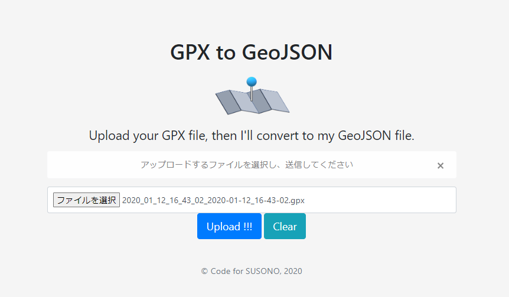
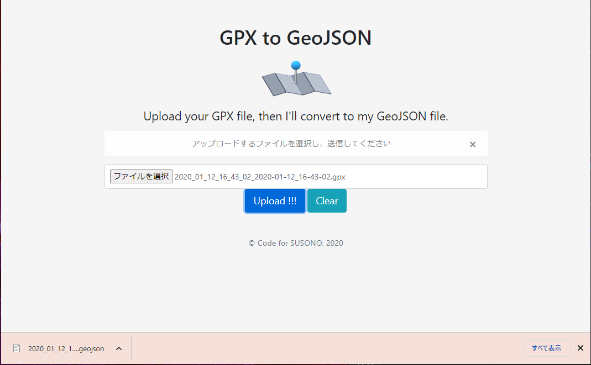

# web_gpx2geojson

web version of gpx2geojson (https://github.com/CodeforSusono/umap_geojson.git)

## web site image

]

## how to use

1. Prepare python virtual environment  
  ```
  $ python -V
  PYthon 3.10.5
  $ python -m venv venv3105
  $ source venv3105/bin/activate
  (venv3105) $ pip list
  Package    Version
  ---------- -------
  pip        22.0.4
  setuptools 58.1.0
  WARNING: You are using pip version 22.0.4; however, version 23.0.1 is available.
  You should consider upgrading via the 'python -m pip install --upgrade pip' command.
  (venv3105) $ python -m pip install --upgrade pip
  Requirement already satisfied: pip in ./venv3105/lib/python3.10/site-packages (22.0.4)
  Collecting pip
    Downloading pip-23.0.1-py3-none-any.whl (2.1 MB)
      ━━━━━━━━━━━━━━━━━━━━━━━━━━━━━━━━━━━━━━━━ 2.1/2.1 MB 8.4 MB/s eta 0:00:00
  Installing collected packages: pip
    Attempting uninstall: pip
      Found existing installation: pip 22.0.4
      Uninstalling pip-22.0.4:
        Successfully uninstalled pip-22.0.4
  Successfully installed pip-23.0.1
  (venv3105) $ pip install -r requirements.txt
  　（省略）
  (venv3105) $
  ```
1. Test view.py behavior
  ```
  $ UPLOAD_DIR ./data python view.py
  * Serving Flask app 'view'
  * Debug mode: on
  WARNING: This is a development server. Do not use it in a production deployment. Use a production WSGI server instead.
  * Running on http://127.0.0.1:5000
  Press CTRL+C to quit
  * Restarting with stat
  * Debugger is active!
  * Debugger PIN: 755-989-183
  127.0.0.1 - - [05/Mar/2023 11:58:03] "GET / HTTP/1.1" 200 -
  127.0.0.1 - - [05/Mar/2023 11:58:03] "GET /static/style.css HTTP/1.1" 304 -
  127.0.0.1 - - [05/Mar/2023 11:58:03] "GET /static/map_pin.png HTTP/1.1" 304 -
  127.0.0.1 - - [05/Mar/2023 11:58:03] "GET /static/icon.png HTTP/1.1" 304 -
  ```
1. Input gpx file
  
1. Geojson file is downloaded
   